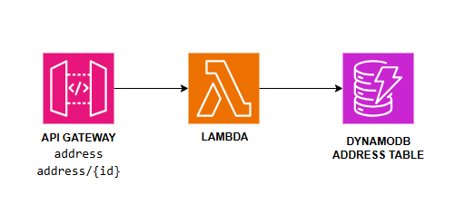

# Address Management Service

This service manages user addresses, providing functionality to retrieve and manage address details associated with user accounts.

### DynamoDB Address Table

- **Table Name**: `AddressTable`
- **Description**: Stores address details with attributes such as ID, user ID, street, city, state, and postal code. Each entry is indexed by the `id` attribute, which is used to quickly retrieve address information during API requests.

This setup ensures efficient and secure handling of address data, making it easily accessible for users while maintaining data integrity and privacy.

    

<!-- ## Monitoring and KPIs

On the business level, the main key performance indicators (KPIs) are the number of order created. The service should also track the number of orders fulfilled and failed. However, these metrics are the result of actions from other services.

From an operational point of view, the latency or errors from the CreateUpdate Lambda function are directly visible to end-users, and therefore should be measured closely. For this purpose, there is an alarm that is breached if the latency exceeds 1 second at p99, meaning that more than 1% of all requests take more than 1 second to complete.

The number of errors from all components and latency for the GetOrder (internal API call) is also tracked as a secondary operational metric.

    

 -->

## API

See [iac/functions/address.yaml](../../iac/functions/address.yml) for a list of available API paths.

<!-- ## Events

See [resources/events.yaml](resources/events.yaml) for a list of available events.

## SSM Parameters

This service defines the following SSM parameters:

* `/ecommerce/{Environment}/orders/api/url`: URL for the API Gateway
* `/ecommerce/{Environment}/orders/api/arn`: ARN for the API Gateway
* `/ecommerce/{Environment}/orders/create-order/arn`: ARN for the Create Order Lambda Function -->