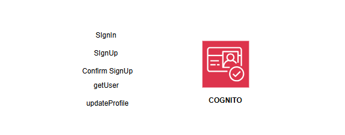

# Auth Management System

This document provides an overview of the auth management system designed.

    

<!-- ## Monitoring and KPIs

On the business level, the main key performance indicators (KPIs) are the number of order created. The service should also track the number of orders fulfilled and failed. However, these metrics are the result of actions from other services.

From an operational point of view, the latency or errors from the CreateUpdate Lambda function are directly visible to end-users, and therefore should be measured closely. For this purpose, there is an alarm that is breached if the latency exceeds 1 second at p99, meaning that more than 1% of all requests take more than 1 second to complete.

The number of errors from all components and latency for the GetOrder (internal API call) is also tracked as a secondary operational metric.

    

 -->

## API

See [iac/functions/auth.yaml](../../iac/functions/auth.yml) for a list of available API paths.