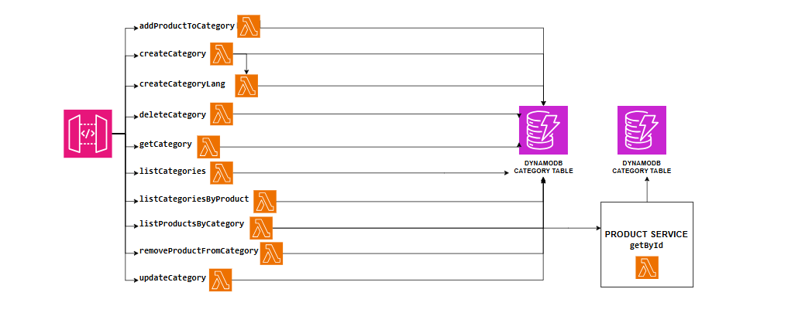

# Category Management System

This document provides an overview of the category management system designed to handle operations such as creation, updating, deletion, and association of products with categories using AWS services.

## Components

### API Gateway

- **Endpoints**:
  - `/addProductToCategory`, `/removeProductFromCategory`: Manage product associations with categories.
  - `/createCategory`, `/updateCategory`, `/deleteCategory`: Handle creation, updates, and deletion of categories.
  - `/getCategory`, `/listCategories`, `/listCategoriesByProduct`, `/listProductsByCategory`: Retrieve category details and their associations with products.

### AWS Lambda Functions

- **Functionality**:
  - `addProductToCategory`: Adds a product to a specified category.
  - `removeProductFromCategory`: Removes a product from a specified category.
  - `createCategory`, `createCategoryLang`: Creates new categories, potentially with specific language parameters.
  - `updateCategory`: Updates the details of an existing category.
  - `deleteCategory`: Deletes a category from the system.
  - `getCategory`, `listCategories`, `listCategoriesByProduct`, `listProductsByCategory`: Retrieves category details and product associations.

### DynamoDB

- **Tables**:
  - **Category Table**: Stores category data, including names, descriptions, and associated products.

### External Services

- **Product Service**:
  - `getById`: Retrieves product details required for category association operations.

## Workflow

1. **Product Association**:
   - Products are added or removed from categories using `/addProductToCategory` and `/removeProductFromCategory` endpoints, which invoke the corresponding Lambda functions to update the Category Table.

2. **Category Operations**:
   - Categories are managed through create, update, and delete operations, each corresponding to specific endpoints that trigger the respective Lambda functions to modify the Category Table.

3. **Data Retrieval**:
   - Category details and associated products can be fetched through various get and list endpoints, efficiently handled by Lambda functions querying the Category Table.

## Security and Access

- **API Authentication**: All endpoints are secured with necessary authentication methods to ensure that only authorized users can access and manipulate category data.
- **IAM Roles**: Lambda functions are assigned IAM roles with permissions specifically tailored to their operational needs, ensuring secure and efficient access to DynamoDB and external product services.

## Error Handling

- **Validation Errors**: Input validation ensures that only correctly formatted data is processed. Errors return informative messages to help correct requests.
- **Operational Errors**: Failures during Lambda operations or database transactions are handled gracefully, with retries where applicable and alerts for continuous failures.

This system provides a comprehensive solution for managing product categories, enabling flexible product categorization and retrieval, which enhances the organization and accessibility of product offerings.

    

<!-- ## Monitoring and KPIs

On the business level, the main key performance indicators (KPIs) are the number of order created. The service should also track the number of orders fulfilled and failed. However, these metrics are the result of actions from other services.

From an operational point of view, the latency or errors from the CreateUpdate Lambda function are directly visible to end-users, and therefore should be measured closely. For this purpose, there is an alarm that is breached if the latency exceeds 1 second at p99, meaning that more than 1% of all requests take more than 1 second to complete.

The number of errors from all components and latency for the GetOrder (internal API call) is also tracked as a secondary operational metric.

    

 -->

## API

See [iac/functions/categories.yaml](../../iac/functions/categories.yml) for a list of available API paths.