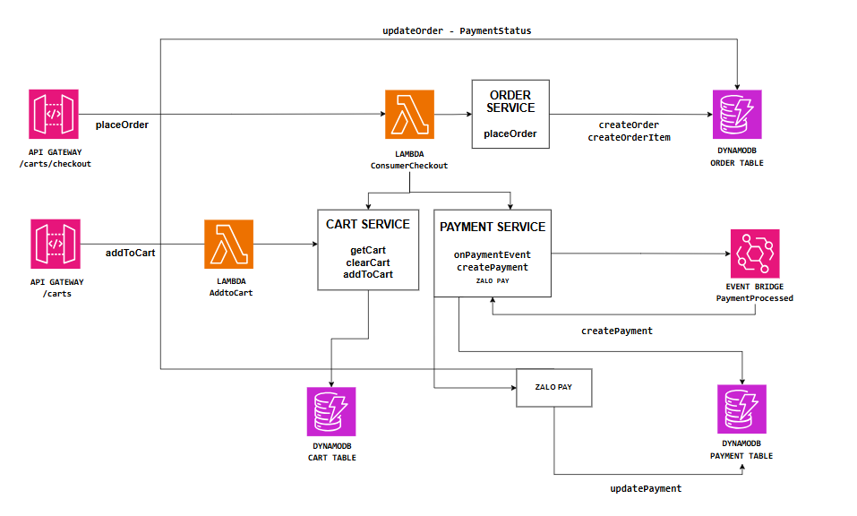
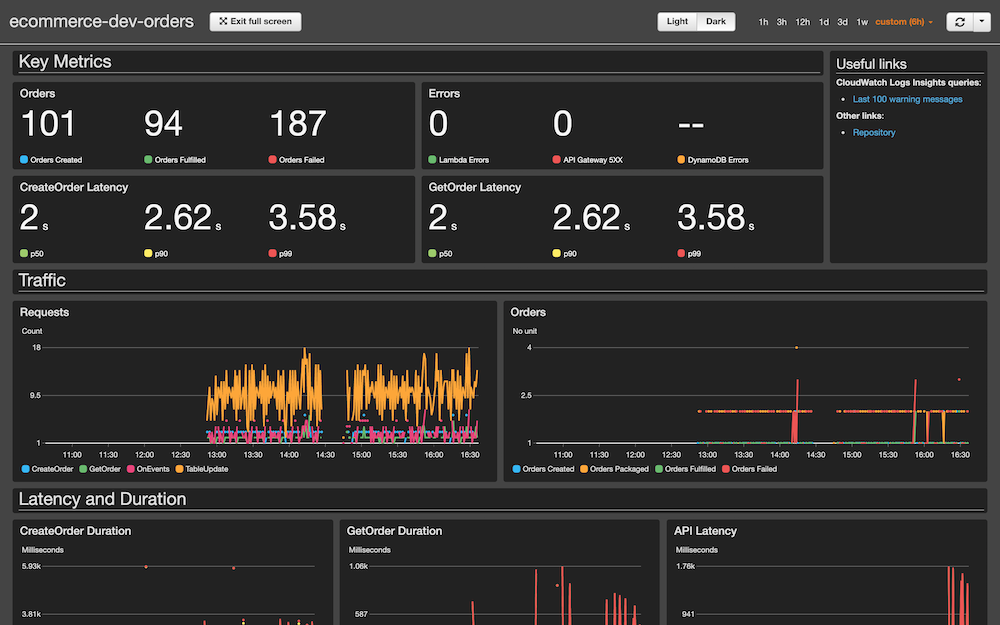

# E-Commerce System Services

This document outlines the various services and components in our e-commerce system, highlighting how they interact within our AWS serverless architecture.

## Cart Service

**Description**:  
The Cart Service manages all interactions with the user's shopping cart. It allows users to add items to their cart and view cart contents.

**Key Operations**:
- `addToCart`: Adds items to the shopping cart.
- `getCart`: Retrieves the contents of the shopping cart.
- `clearCart`: Clears all items from the shopping cart upon checkout.

**Data Storage**:
- **DynamoDB Cart Table**: Stores all cart items linked to a user session.

## Order Service

**Description**:  
The Order Service is responsible for all aspects of order processing and management. It ensures data consistency by replicating necessary details such as product information and delivery addresses within each order record.

**Key Operations**:
- `placeOrder`: Processes the user's checkout operations and transitions cart items to an order.
- `createOrder`: Creates a new order in the system.
- `updateOrder`: Updates order details, typically triggered by internal system events.

**Data Storage**:
- **DynamoDB Order Table**: Maintains records of all orders with their current status and associated details.

## Payment Service

**Description**:  
The Payment Service handles financial transactions and manages the integration with payment gateways like Zalo Pay.

**Key Operations**:
- `createPayment`: Initiates a payment transaction for an order.
- `onPaymentEvent`: Listens for and processes payment events from Zalo Pay.

**Data Storage**:
- **DynamoDB Payment Table**: Logs all payment transactions linked to orders.

**Integrations**:
- **EventBridge**: Utilized for publishing payment processing events which are essential for updating order statuses and triggering subsequent actions in other services.

## Architecture Overview

**API Gateway**:
- Routes incoming API requests to the appropriate Lambda functions for handling specific actions related to carts, orders, and payments.

**AWS Lambda**:
- Manages the execution of business logic in a scalable, serverless manner. Each function is designed to perform a specific task, ensuring that system responsibilities are well-distributed.

**AWS EventBridge**:
- Facilitates inter-service communication, crucial for maintaining a responsive and reliable service architecture.

---

For more detailed documentation on each service and their APIs, refer to the respective sections in this repository.

    

<!-- ## Monitoring and KPIs

On the business level, the main key performance indicators (KPIs) are the number of order created. The service should also track the number of orders fulfilled and failed. However, these metrics are the result of actions from other services.

From an operational point of view, the latency or errors from the CreateUpdate Lambda function are directly visible to end-users, and therefore should be measured closely. For this purpose, there is an alarm that is breached if the latency exceeds 1 second at p99, meaning that more than 1% of all requests take more than 1 second to complete.

The number of errors from all components and latency for the GetOrder (internal API call) is also tracked as a secondary operational metric.

    

 -->

## API

See [iac/functions/cart.yaml](../../iac/functions/carts.yml) for a list of available API paths.

<!-- ## Events

See [resources/events.yaml](resources/events.yaml) for a list of available events.

## SSM Parameters

This service defines the following SSM parameters:

* `/ecommerce/{Environment}/orders/api/url`: URL for the API Gateway
* `/ecommerce/{Environment}/orders/api/arn`: ARN for the API Gateway
* `/ecommerce/{Environment}/orders/create-order/arn`: ARN for the Create Order Lambda Function -->